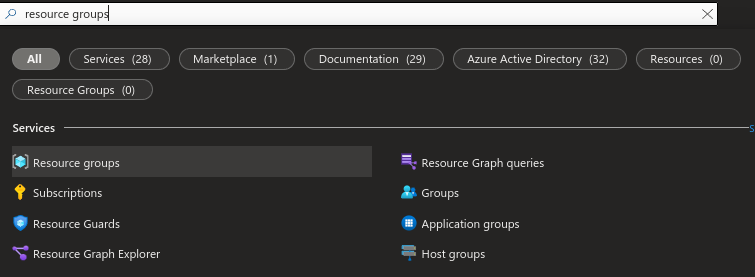
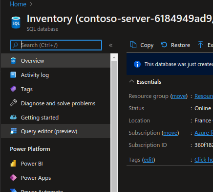

# Implementing a SQL database inside Azure using the Azure Portal


---------------------------------------------------------


## Requirements
- Microsoft Azure Account ( with funds or credits    )
- Microsoft Azure Suscription
- A web browser
- Access to internet

---------------------------------------------------------

## Instructions
#### 1. Login to the [Azure Portal](https://portal.azure.com/).
#### 2. Once you're on the portal's home page, you will see something like this:

#### 3. Click on the Cloud Shell Icon at the top of the page.

#### 4. If you haven't used Cloud Shell before, you will need to create a storage account. Just click *Create storage* to do so.

#### 5. Once the storage has been created, you will be able to use Cloud Shell.

#### 6. We'll be using [this](https://github.com/josejesusguzman/acordeon-az900-innovaccion/blob/main/res/consultas-sql.md) repository for guidance. First, copy the following commands and paste them one by one inside your Azure Cloud Shell (this may take a while).
```Bash
git clone https://github.com/MicrosoftLearning/DP-900T00A-Azure-Data-Fundamentals dp-900
```
```Bash
cd dp-900/sql
```
```Bash
bash setup.sh
```

#### 7. Once the process has been completed, click on the searchbar at the top of the page and look for *Resource groups*, then click on it.

#### 8. Inside your last resource group, a SQL server and a SQL database have been created, click on it and make sure they're inside (if they aren't, look inside other resource groups until you find them).

#### 9. Click on the SQL database (Inventory).

#### 10. Click on *Overview* and then *Set sever Firewall*.

#### 11. In *Firewall Rules*, click on *Add your client IPv4 address*.

#### 12. Click *Save*.

#### 13. Go back to your database and click *Query editor*.

#### 14. Login to your database using the following credentials:
> Login: sampleLogin
> Password: samplePassword123!
#### 15. You are now able to do SQL queries to the table. For example:
```SQL
SELECT * FROM Inventory;
```

#### 16. You can also insert items into your tables.
```SQL
INSERT INTO Inventory (Id, Inventory.Name, Stock) values(17, 'Pineapple', 999);
```


---------------------------------------------------------

## Congratulations ! You've just implement a SQL Database inside Microsoft Azure !
